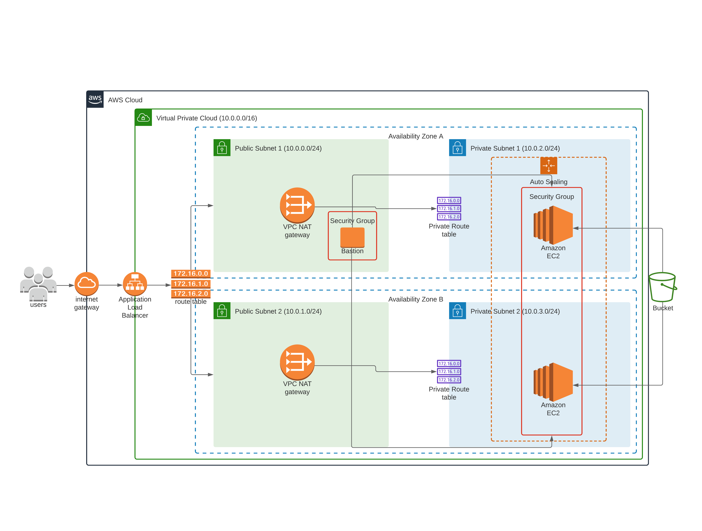
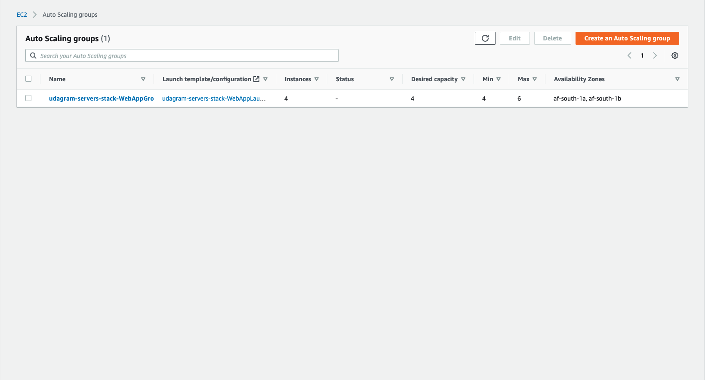
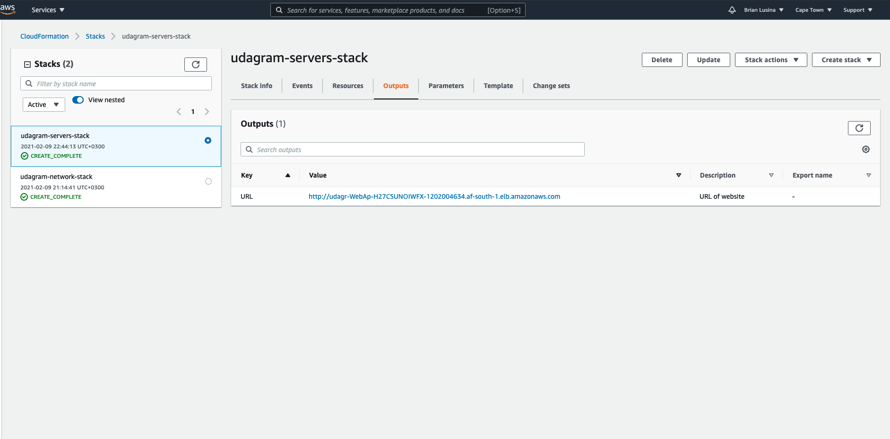
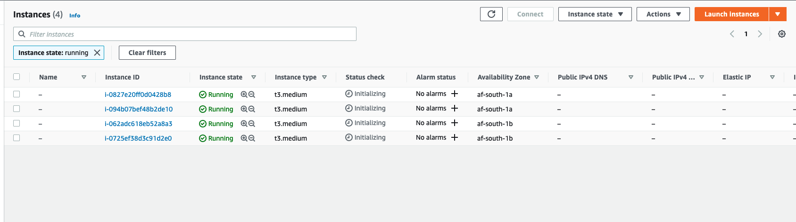
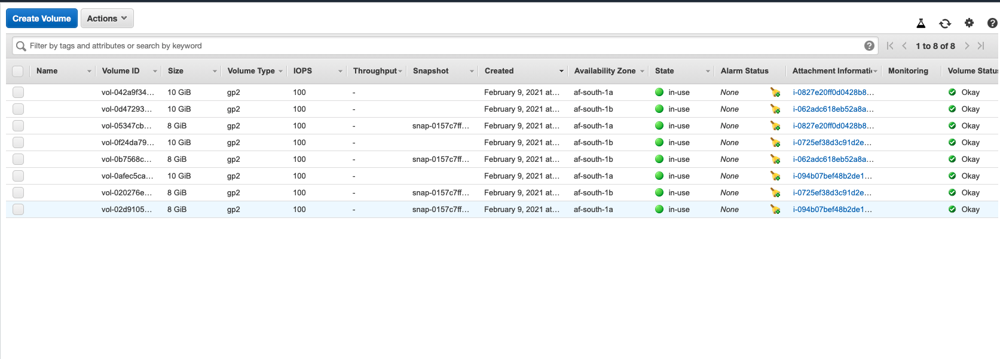
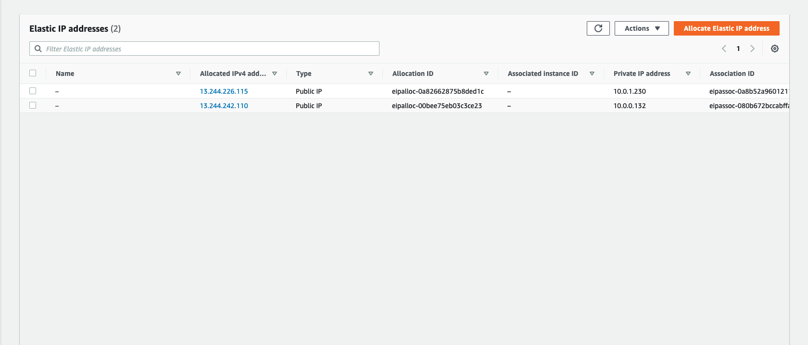
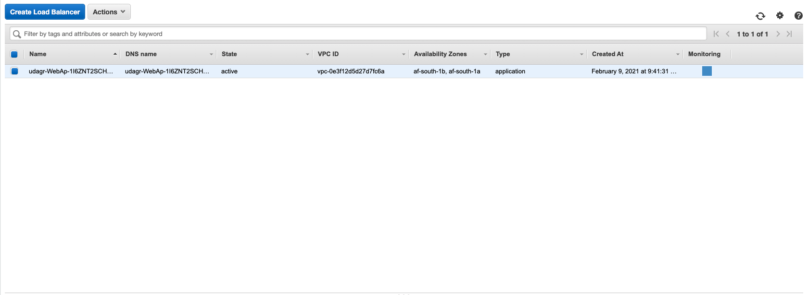
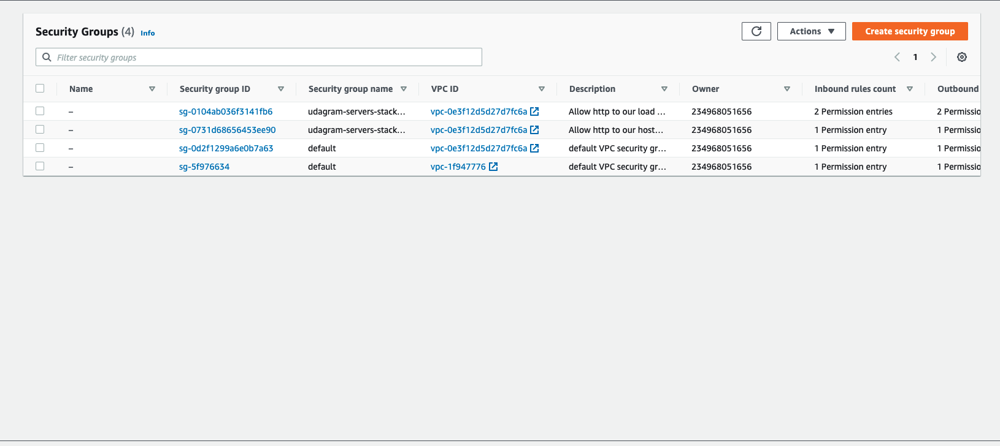
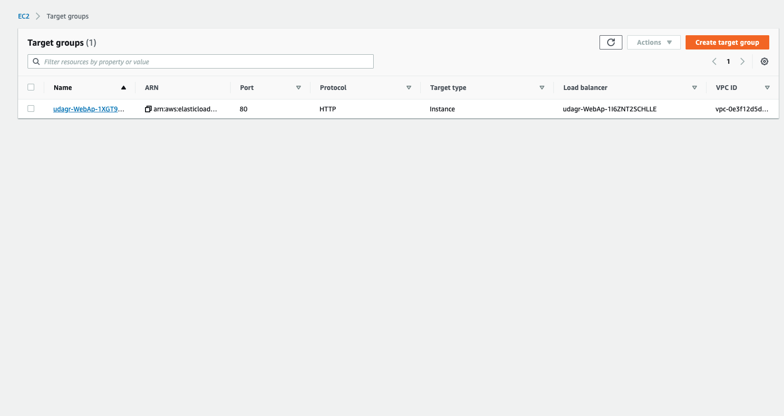
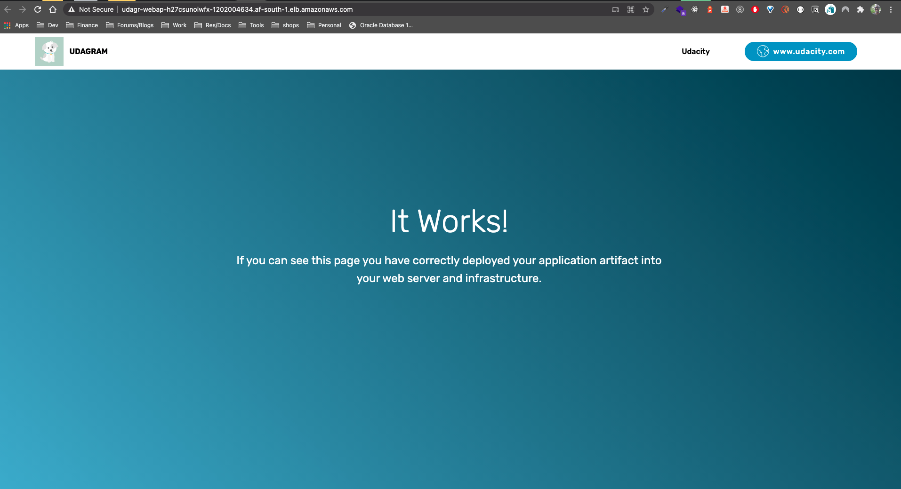

# Udagram Cloud

AWS Cloud Formation Configuration for setting up a simple cloud infrastructure for a highly available Web application.



## Dependencies

### AWS Account

You would require to have an AWS account to be able to build this cloud infrastructure.

### Code editor

An editor would be helpful to visualize the image as well as code.

### AWS CLI

This is needed to be able to interact with AWS resources from your development machine as well as deploy the CloudFormation stacks


---

The [network.yaml](./networking/network.yaml) file is for creating the network VPC, Subnets etc. using the [network.params.json](./networking/network.params.jon) as input parameters. The [jumpbox.yaml](./servers/jumpbox.yaml) creates a Jumpbox Host to remote into the Web Servers using [jumpbox.params.json](./servers/jumpbox.params.json) as the input. The webservers which include the Load Balancer, AutoScaling Groups and Security Groups are created using [servers.yaml](./servers/servers.yaml) using the [servers.params.json](./servers/servers.params.json) file as the input. There are also a couple of batch files which ease the creation and updating of the stacks. Please ensure that you have a pre-created Key Pair for the Bastion/JumpBox Host. Ensure that you use the same environment variable for all the stacks.

## Instructions

First create the networking by running the [create-stack.sh](./create-stack.sh) or the [create-stack.bat](./create-stack.bat) if on Windows. as below:

```
./create-stack <NAME-OF-STACK> networking/network.yaml networking/network.params.json <REGION>
```

Then create the JumpBox or Bastion Host using the same shell script.

```
./create-stack <NAME-OF-STACK> servers/jumpbox.yaml servers/jumpbox.params.json <REGION>
```

Then create the Web Stack by running the below command:

```
./create-stack <NAME-OF-STACK> servers/servers.yaml networking/servers.params.json <REGION>
```

> <NAME-OF-STACK> is the name you intend to give your stack & <REGION> is the region you intend to deploy your stack. If a region is not specified, the default is used by the aws cli as specified in the configuration when setting up aws cli.

## Images

The below screenshots indicate the infrastructure setup with the cloud formation configuration


> Auto Scaling Groups


> Cloud Formation Stacks


> EC2 instances


> EC2 Volumes


> Elastic IP Addresses


> Load Balancer


> Security Groups


> Target Groups


> Website
